<picture>
  <source media="(prefers-color-scheme: dark)" srcset="docs/assets/hero-dark.svg">
  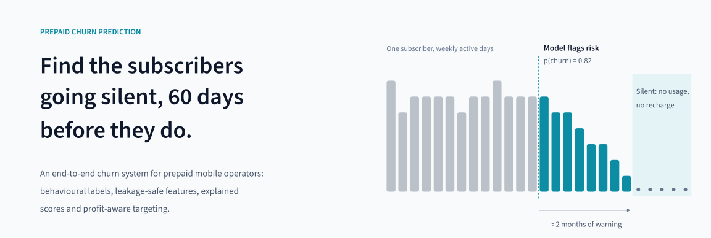
</picture>

<p align="center">
  <a href="#overview">Overview</a> ·
  <a href="#results">Results</a> ·
  <a href="#validated-on-real-prepaid-data">Real data</a> ·
  <a href="#who-to-contact-uplift-and-the-sleeping-dog-guard">Uplift</a> ·
  <a href="#operating-it">Operations</a> ·
  <a href="#quickstart">Quickstart</a> ·
  <a href="docs/architecture.md">Architecture</a> ·
  <a href="docs/interview_guide.md">Interview guide</a>
</p>

<p align="center">
  <a href="https://github.com/noushad999/prepaid-churn-prediction/actions/workflows/ci.yml"></a>
  
  
</p>

<picture>
  <source media="(prefers-color-scheme: dark)" srcset="docs/assets/stats-dark.svg">
  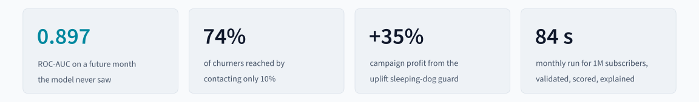
</picture>

## Overview

In prepaid mobile markets like Bangladesh, where more than 95% of connections are prepaid, customers rarely cancel. They stop recharging, move their spending to a second SIM, and go quiet. By the time a CRM team notices, the subscriber is gone.

This repository is a complete, deployable churn system for that problem. It is built the way an operator's data science and platform teams would build it:

- **It runs on operator data.** A data contract validates every extract. Column names and codes are mapped from config for CSV, Parquet or SQL sources, and MSISDNs are pseudonymised at the boundary.
- **Churn is observed, not labelled.** A subscriber is a churner if they have zero usage *and* zero recharge for 60 days after a snapshot. Features are point-in-time and tested for leakage.
- **It predicts risk and decides action.** LightGBM ranks risk. SHAP reason codes name the root cause and the offer. An uplift model blocks *sleeping dogs*: subscribers whom an offer would push out.
- **It proves its own value.** Every campaign keeps a 10% holdout. Two months later a backtest measures the real save rate and the model's realised accuracy.
- **It operates itself.** A registry with a champion/challenger gate and rollback, drift monitoring, a secured API with metrics, a CVM dashboard, and Kubernetes/Airflow deployment.

<details>
<summary><b>What's in the box</b></summary>
<br>

| Capability | Module | Command |
|:--|:--|:--|
| Behavioural operator-DWH simulator (6 tables, call graph, randomised campaigns) | `simulate.py` | `churn simulate` |
| Data contract, operator ingestion, pseudonymisation | `contract.py`, `ingest.py` | `churn validate` |
| Point-in-time features (92) and the 60-day silence label | `features.py` | – |
| Churn model, baselines, out-of-time evaluation | `train.py`, `evaluate.py` | `churn train [--as-of]` |
| Uplift X-learner (seed ensemble), Qini, policy economics | `uplift.py`, `campaign.py` | – |
| Reason codes: SHAP → root-cause driver → next best action | `explain.py` | – |
| Batch scoring, sleeping-dog guard, holdout arm, drift (PSI) | `score.py`, `monitor.py` | `churn score --month` |
| Model registry, champion/challenger gate, rollback | `registry.py` | `churn models · promote · rollback` |
| Realised performance and measured campaign effect | `backtest.py` | `churn backtest --month` |
| Scoring API: auth, Prometheus metrics, hot reload | `api.py` | `churn serve` |
| CVM dashboard | `dashboard.py` | `streamlit run src/churn/dashboard.py` |
| Docker, Compose, Kubernetes, Airflow | `Dockerfile`, `deploy/` | `docker compose up` |

</details>

## Why prepaid churn is hard

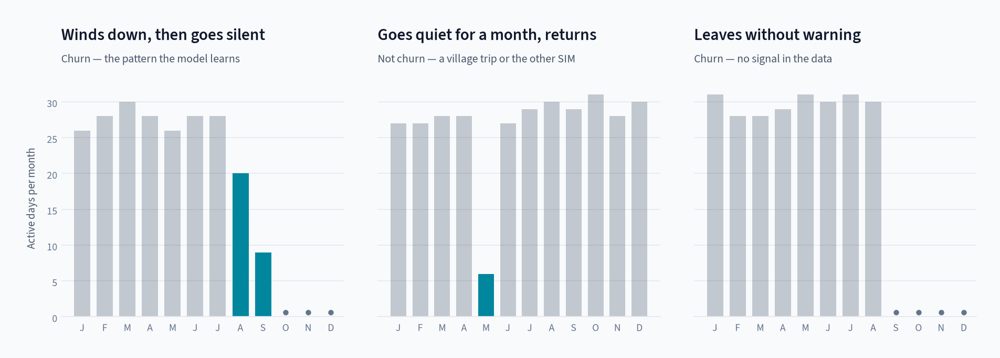

<sub><b>Figure 1.</b> Monthly active days for three subscribers from the simulated operator. Teal bars mark months of reduced activity; dots mark months with no activity at all.</sub>

The model has to tell the first pattern from the second: both show a sharp drop, and only one ends in churn. The third pattern is the irreducible floor, because some subscribers leave with no behavioural warning. The simulated data contains all three, plus:

- *social contagion*: subscribers are more likely to leave once their contacts have left
- *competitor pull*: calls drift to a rival network before the switch
- competitor promotions, a July tariff change and Eid-season dormancy

## Approach

<picture>
  <source media="(prefers-color-scheme: dark)" srcset="docs/assets/pipeline-dark.svg">
  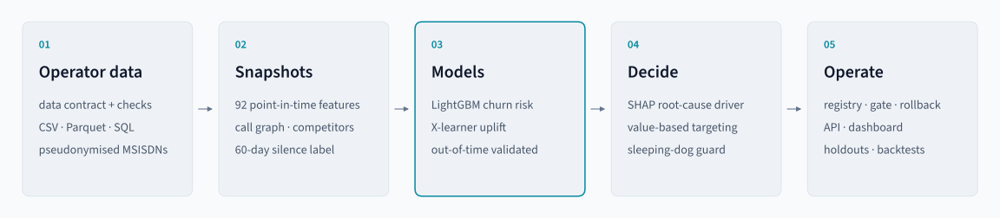
</picture>

**01 · Operator data.** Six tables, defined in the [data contract](docs/data_contract.md): `subscribers`, `usage_monthly` (with minutes to Robi, Banglalink and Teletalk), `recharges` (one row per transaction), `network_market`, and the optional `contacts` (CDR call graph) and `campaigns` (randomised treatment/holdout). `churn validate` blocks the run on the following, and reports volume jumps as warnings:

- duplicate keys, broken types, nulls
- unknown codes, orphan ids, month gaps

**02 · Snapshots.** One row per subscriber active in the cutoff month. The 92 features cover:

- recency and active-day trends
- recharge gaps and ticket sizes
- usage trends
- experienced network quality
- **competitor share of minutes** and its trend
- **contacts who recently went silent**
- credit stress and tenure

A test deletes every record after the cutoff and asserts that no feature changes.

**03 · Models.** LightGBM churn risk is trained on five monthly snapshots (1.59M rows), early-stopped on August and tested on October. That mirrors production, where only months whose 60-day outcome has closed are labelled. Alongside it, a seed-ensembled **X-learner** is fit on the randomised April and June campaigns and tested on September.

**04 · Decide.**
- SHAP contributions roll up into driver families, and the strongest *root cause* chooses the offer.
- Expected value decides who is worth contacting.
- The uplift model vetoes subscribers the offer would push out.

**05 · Operate.**
- Registry with a promotion gate and rollback, batch scoring with a holdout arm, and PSI drift checks.
- Realised backtests, a secured API and the dashboard.

## Results

All numbers come from **October**, a month excluded from training and model selection. It has 306,094 active subscribers, 3.8% of whom churned.

<div align="center">

| | **LightGBM** | Logistic regression | Recency rule¹ |
|:--|:--:|:--:|:--:|
| ROC-AUC | **0.897** | 0.876 | 0.780 |
| PR-AUC | **0.548** | 0.404 | 0.246 |
| KS statistic | **0.670** | 0.631 | 0.410 |
| Precision in the top 5% | **48.2%** | 40.3% | 32.3% |
| Churners reached by contacting 10% | **74.2%** | 68.7% | 48.1% |

</div>

<sub>¹ Rank by days since last recharge, the classic pre-ML CRM rule.</sub>

<p align="center">
  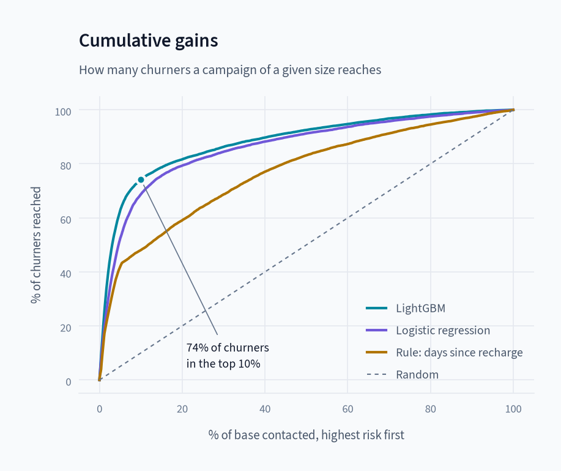
  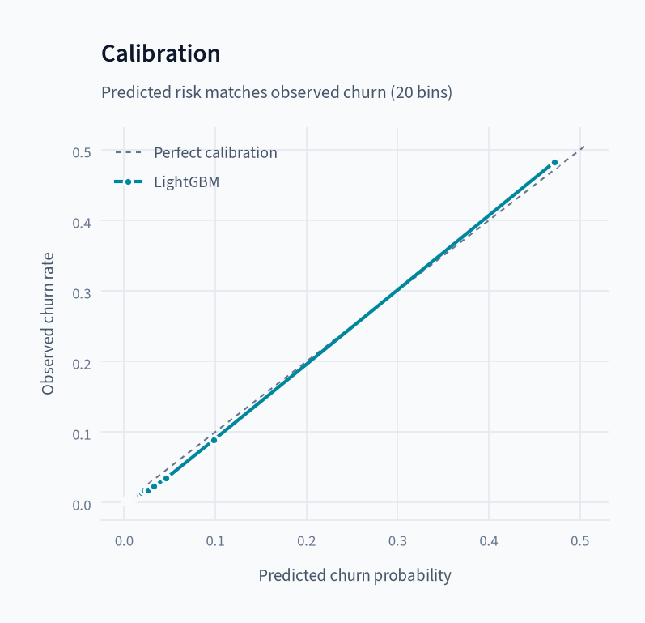
</p>

<sub><b>Figure 2.</b> Left: share of churners reached as a campaign grows, highest risk first. Right: predicted versus observed churn. The scores are calibrated (Brier 0.024) and can be used directly as probabilities.</sub>

The highest-risk decile has a 28.6% churn rate, 7.4 times the base rate, and holds 74% of all churners.

<details>
<summary><b>ROC and precision–recall curves, decile table</b></summary>
<br>

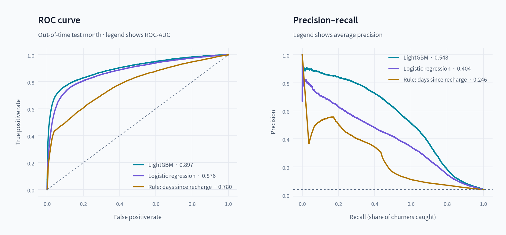

| Decile | Subscribers | Churners | Churn rate | Lift | Cumulative capture |
|:--:|--:|--:|--:|--:|--:|
| 1 | 30,610 | 8,742 | 28.6% | 7.42 | 74.2% |
| 2 | 30,609 | 876 | 2.9% | 0.74 | 81.7% |
| 3 | 30,610 | 544 | 1.8% | 0.46 | 86.3% |

Full metrics: [`reports/metrics.json`](reports/metrics.json) · [`reports/gains_test.csv`](reports/gains_test.csv) · [model card](reports/model_card.md)

</details>

## Validated on real prepaid data

The headline results come from a simulated operator, because subscriber data can't be published. To check the system on data it wasn't designed around, the same pipeline was run, unchanged, on a public dataset of **99,999 real prepaid subscribers** (an Indian telecom circle, four months). Only a [mapping file](examples/real_data/config.yaml) and an [adapter](examples/real_data/prepare_indian_telco.py) were written.

<div align="center">

| Out-of-time: August snapshot, September outcome (92,091 subscribers, 4.4% churn) | **LightGBM** | Logistic regression | Recency rule |
|:--|:--:|:--:|:--:|
| ROC-AUC | **0.853** | 0.807 | 0.742 |
| PR-AUC | **0.279** | 0.173 | 0.090 |
| Churners reached by contacting 10% | **55.0%** | 45.2% | 23.9% |

</div>

<p align="center">
  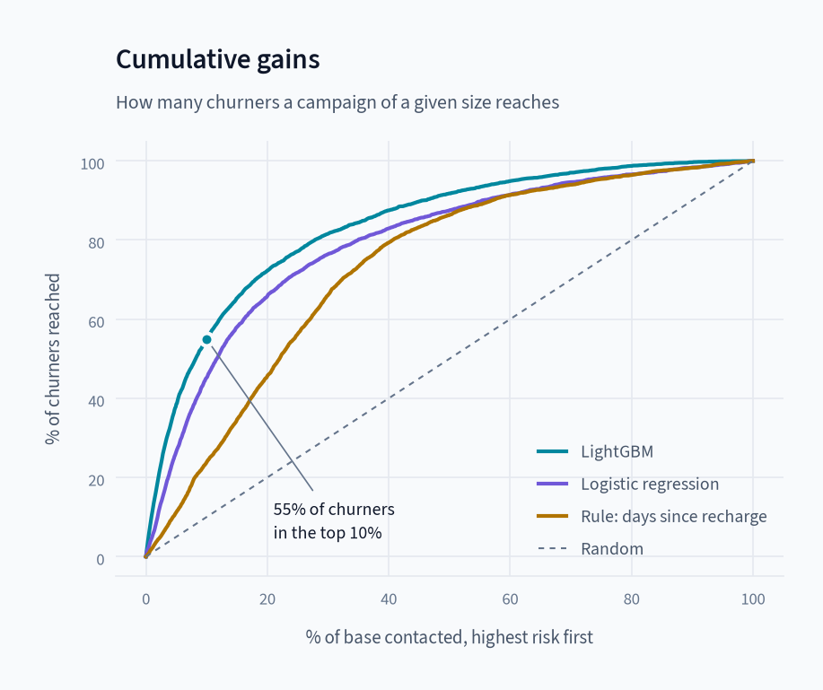
  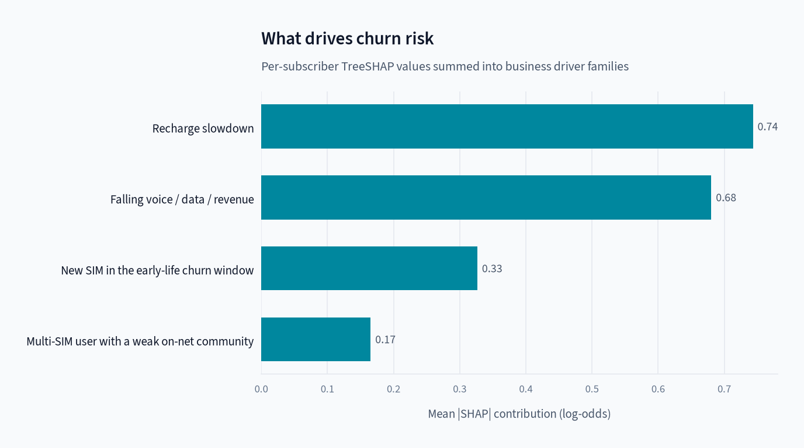
</p>

<sub><b>Figure 3.</b> The real dataset. Left: churners reached as the campaign grows. Right: what drives the scores.</sub>

- **The contract did its job.** `churn validate` passed with 0 errors and flagged the 13 inputs this export lacks (active days, network quality, the call graph, campaigns). The related features and the uplift model were skipped automatically.
- **The same signals lead.** Voice-usage trend, days since last recharge, tenure and recharge trend rank highest, the recency and trend signals the simulator encodes.
- **The score is lower than on the simulated operator** (0.853 vs 0.897). The export has 40 features instead of 92 and two months of history, and the test is a genuinely later month. Many public notebooks on this dataset report higher numbers from random splits.

Details, the three data adaptations and what this does *not* validate: [docs/real_data.md](docs/real_data.md).

## Who to contact: uplift and the sleeping-dog guard

A churn score answers *who is at risk*. A campaign only earns money on subscribers whose behaviour the offer *changes*. The randomised campaigns (50% treatment, 50% holdout) make that measurable. The table below shows out-of-time results on the September campaign (92,540 subscribers):

| Targeting policy | Qini coefficient | Churners prevented per 1,000 treated (top 10%) | Best net campaign value |
|:--|--:|--:|--:|
| **Churn risk × value, sleeping-dog guard** | **1.39** | **48.1** | **43.0k ৳** |
| Uplift (X-learner) alone | 1.43 | 43.0 | 26.6k ৳ |
| Churn risk × value, no guard | 1.10 | 41.3 | 31.9k ৳ |
| Random | −0.07 | −0.7 | 0 |

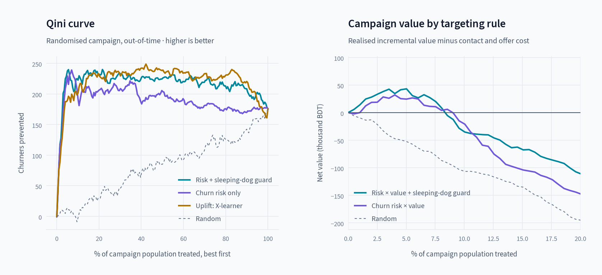

<sub><b>Figure 4.</b> Left: churners prevented as more of the campaign population is treated. Right: realised net value (saved margin minus contact and offer cost) by targeting depth.</sub>

Retention effects are small (3.8 per 1,000 on average) and noisy. Uplift alone ranks well on Qini, but it ignores subscriber value and misses high-value churners at the top of the list. Plain risk ranking has the opposite problem: it spends offers on sleeping dogs. The production policy combines them. It ranks by risk × value, and the uplift model acts as a **guard** that blocks subscribers predicted to react badly to contact (45% of the campaign population). That lifts campaign profit **35%** over plain risk ranking. A single uplift fit swung between 31k and 46k ৳ depending on its random seed, so production uses a 5-seed ensemble.

`churn backtest` then measured the September campaign's real effect from its holdout: **3.8 churners prevented per 1,000 treated (95% CI 1.2–6.4), a 9% save rate**, against the 30% originally assumed in the configuration (now recalibrated). That gap is exactly why every campaign keeps a holdout.

## Explaining every score

<p align="center">
  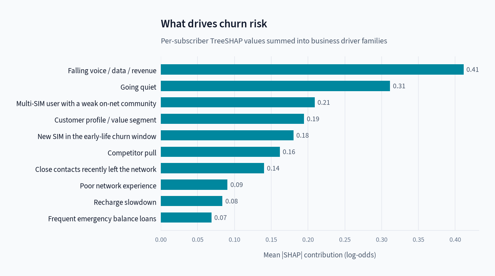
  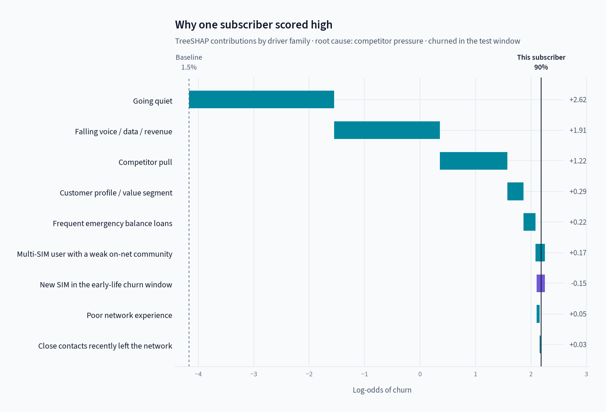
</p>

<sub><b>Figure 5.</b> Left: average influence of each driver family. Right: one subscriber's score built up from the baseline. Their activity is fading, and the root cause the offer should address is competitor pull.</sub>

Per-subscriber TreeSHAP values are summed into ten driver families. The families come in two kinds:

- **Symptoms:** going quiet, falling usage, recharge slowdown.
- **Causes:** new SIM, network experience, competitor pull, social contagion, credit stress, multi-SIM.

Symptoms carry most of the weight, but only a cause can be acted on. `primary_driver` is the strongest cause, and it selects the next best action:

| Primary driver | Recommended action |
|:--|:--|
| `early_life` | Onboarding journey: bonus on 2nd/3rd recharge, app sign-up reward |
| `competitor_pressure` | Price-matched counter-offer against the competitor the subscriber calls most |
| `social_contagion` | Friends & family bundle: on-net group minutes to keep the circle together |
| `network_experience` | Proactive care call, ticket for the serving site, goodwill minutes |
| `credit_stress` | Higher emergency-balance limit, micro packs |
| `multi_sim_low_loyalty` | "Primary SIM" loyalty offer: on-net minutes and FnF bonus |

## Operating it

```bash
churn validate                       # data contract → reports/data_quality.json (errors block the run)
churn train --as-of 2025-12          # rolling out-of-time windows → new registry version → gate
churn models                         # versions, champion, gate decisions
churn score --month 2025-12          # scores, campaign list with holdout arm, drift report
churn backtest --month 2025-10       # two months later: realised metrics + measured save rate
churn rollback                       # restore the previous champion
```

- **Champion/challenger.** A new model is promoted only if, on *its own* test month, it doesn't lose more than 0.005 in PR-AUC or capture@10% against the champion scored on exactly the same rows. Every decision is recorded in `artifacts/registry/registry.json`.
- **Drift.** Each scoring run computes PSI per feature and for the score. In the December run, a simulated network event pushed `drop_call_rate_m0` to PSI 0.55 while the score stayed stable (0.004).
- **Realised monitoring.** `churn backtest` compares realised ROC-AUC, PR-AUC and capture with what the model promised on its test month, and raises `DEGRADED` beyond the thresholds in config.
- **Segments and fairness.** Every training run checks calibration, within-segment ROC-AUC and the share of churners the campaign policy reaches, by division, urban/rural, gender, plan, handset and tenure. Gaps beyond the thresholds in config are flagged for review. On October, all 21 segments passed: calibration gaps stay under 0.01 and ROC-AUC between 0.87 and 0.91. New SIMs (0–2 months) are the hardest group (0.866).
- **Model card.** Each registered version gets a generated [model card](reports/model_card.md): data window, intended and out-of-scope uses, performance against baselines, uplift policy, drivers, the segment table and the data-contract status.

The monthly cycle runs as a Kubernetes CronJob or an Airflow DAG: validate → train → score → backtest → hot-reload the API. See [architecture](docs/architecture.md), [deployment](docs/deployment.md) and the [runbook](docs/runbook.md).

### Dashboard

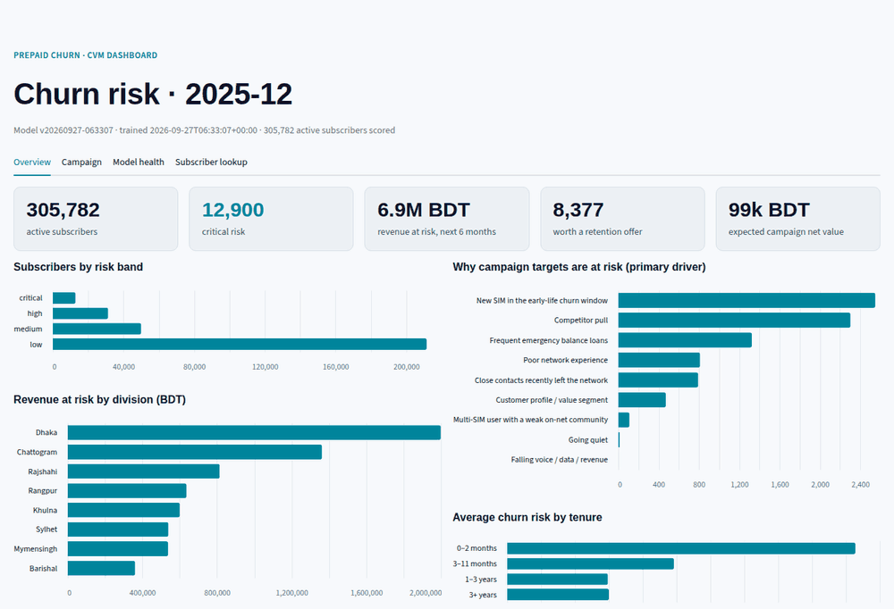

<sub><b>Figure 6.</b> The CVM dashboard. Overview: risk, revenue at risk and drivers. Campaign builder: raising the offer cost shrinks the profitable list in real time, with CSV export. Model health: metrics, drift, registry and backtests. Subscriber lookup: the score, reasons and next best action for a call-centre agent.</sub>

<details>
<summary><b>Full-size screenshots</b></summary>
<br>

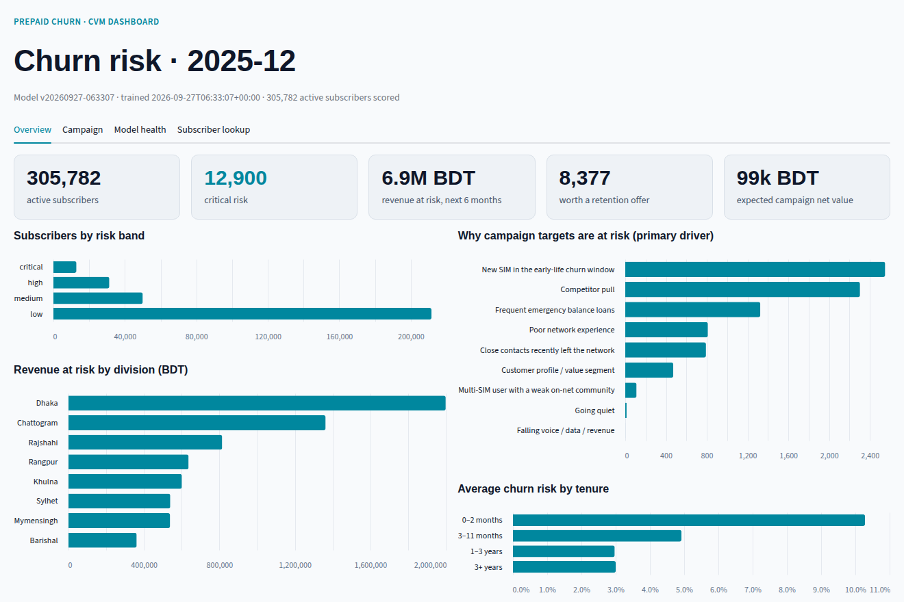

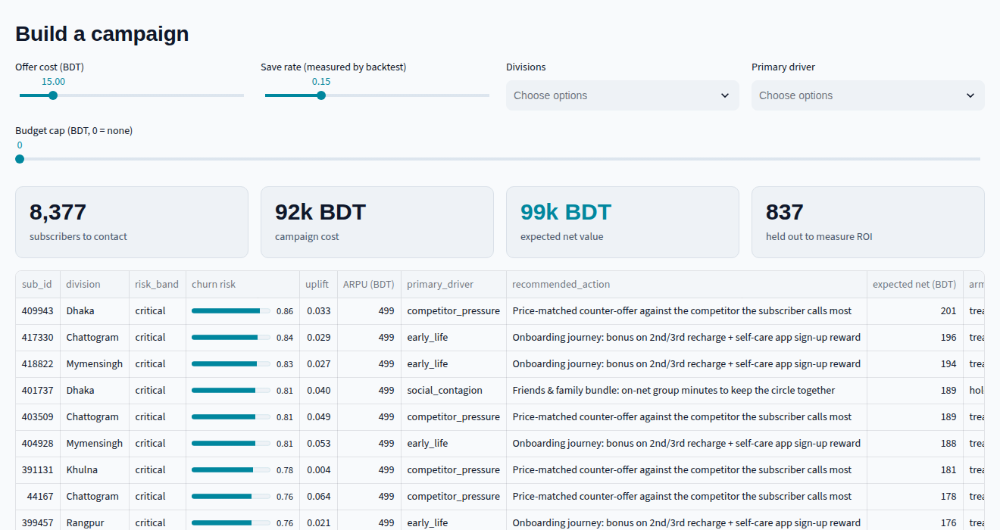

</details>

### API

```bash
curl -H "X-API-Key: $KEY" localhost:8000/v1/subscribers/409943
```
```json
{
  "sub_id": 409943, "division": "Dhaka", "tenure_months": 2, "arpu_3m": 499.0,
  "churn_probability": 0.86, "risk_band": "critical", "uplift": 0.033, "sleeping_dog": false,
  "expected_net_value": 201.5, "target": true, "arm": "treatment",
  "primary_driver": "competitor_pressure",
  "recommended_action": "Price-matched counter-offer against the competitor the subscriber calls most",
  "reasons": [{"code": "usage_decline", "description": "Falling voice / data / revenue"},
              {"code": "inactivity", "description": "Going quiet: fewer active days, long time since last activity"}],
  "model_version": "v20260927-063307"
}
```

| Endpoint | Auth | Purpose |
|:--|:--:|:--|
| `POST /v1/predict` | key | Score up to 10k feature vectors with reasons, uplift and action |
| `GET /v1/subscribers/{id}` | key | Latest batch score, for CRM and call-centre lookups |
| `GET /v1/model` | key | Model version, training window, test metrics |
| `POST /admin/reload` | key | Hot-swap to the newly promoted champion |
| `GET /health`, `GET /metrics` | open | Probes and Prometheus |

Keys are held as SHA-256 digests and compared in constant time. Access logs are JSON with request ids and never contain features or identifiers. See [security](docs/security.md).

### Performance

| Workload, 4 vCPU container | Time |
|:--|--:|
| Monthly run, **1M subscribers** (12.6M usage rows, 30M recharges, 11.8M contact edges): contract, features, scores, uplift, reasons, campaign list, drift | **84 s** |
| Monthly run, 300k subscribers | 24 s |
| Training: churn model on 1.59M rows × 92 features, plus baselines and uplift ensemble | ~3.5 min |
| API: one subscriber with SHAP reasons and 5-model uplift | 4.8 ms model · 7.2 ms p50 HTTP |
| API: batch-score lookup | 1.9 ms p50 |

## Quickstart

```bash
git clone [https://github.com/noushad999/prepaid-churn-prediction.git](https://github.com/noushad999/TeliChurn.git)
cd prepaid-churn-prediction
python -m venv .venv && source .venv/bin/activate
pip install -e ".[dev,dashboard]"

churn pipeline                                  # simulate a 300k-subscriber operator, train, score (~4 min)
churn serve                                     # API at http://localhost:8000/docs
streamlit run src/churn/dashboard.py            # dashboard at http://localhost:8501
pytest                                          # 40 tests
```

With Docker, `CHURN_API_KEYS=my-key docker compose up --build` runs the pipeline, API, dashboard and Prometheus.

CI checks all of this on every push. It runs the linter and the tests. The image is built and runs the full pipeline inside the container. The API is then started from it and checked for authentication, predictions and metrics. The Kubernetes manifests are rendered with kustomize and validated against the Kubernetes 1.30 schemas.

## Using real operator data

Copy [`configs/operator_example.yaml`](configs/operator_example.yaml), map your extract names and codes, and set `CHURN_PII_SALT`:

```bash
churn --config configs/my_operator.yaml validate     # fix mappings until the contract passes
churn --config configs/my_operator.yaml train --as-of 2025-12
```

Sources can be CSV, Parquet or SQL (`pip install -e ".[sql]"`). `contacts` and `campaigns` are optional: without them, the related features and the uplift guard are skipped. Scaling notes for 80M+ subscribers are in [architecture](docs/architecture.md#scaling-to-a-national-operator-80m-subscribers).

## Documentation

| Document | For |
|:--|:--|
| [Architecture](docs/architecture.md) | System design, monthly cycle, decisions, scaling |
| [Data contract](docs/data_contract.md) | Every table, column, type and rule |
| [Deployment](docs/deployment.md) | Compose, Kubernetes, Airflow, configuration, observability |
| [Security & privacy](docs/security.md) | Pseudonymisation, access control, governance |
| [Runbook](docs/runbook.md) | What to do when something fails |
| [Real-data validation](docs/real_data.md) | The pipeline on 99,999 real prepaid subscribers |
| [Model card](reports/model_card.md) | Current champion: data, intended use, performance, segments |
| [Write-up](docs/writeup.md) | The project as a story: problem, decisions, results |
| [Interview guide](docs/interview_guide.md) | Design decisions and likely questions |

## Limitations

- **The headline data is simulated.** The simulator encodes how prepaid markets behave, but its figures illustrate the method, not any operator's results. The [real-data run](#validated-on-real-prepaid-data) shows the churn model transfers. What an operator buys is the system: the contract, label, leakage controls, evaluation, uplift guard, holdouts and operations.
- **Uplift needs randomised campaigns.** The guard is only as good as the test-and-learn data behind it. An operator without holdouts should start them before relying on it.
- **Reasons explain the model, not the world.** A driver is a hypothesis for the retention team, not a causal finding. Only the holdout-measured effect is causal.

## License

Copyright © 2025–2026 Md Noushad Jahan Ramim. **All rights reserved.**

This repository is published for viewing and evaluation only. It is not open source. Copying, modifying, redistributing, using any part of it in another project, or presenting it as your own work requires written permission. See [LICENSE](LICENSE) for the full terms. The bundled Source Sans 3 font remains under the SIL Open Font License.
